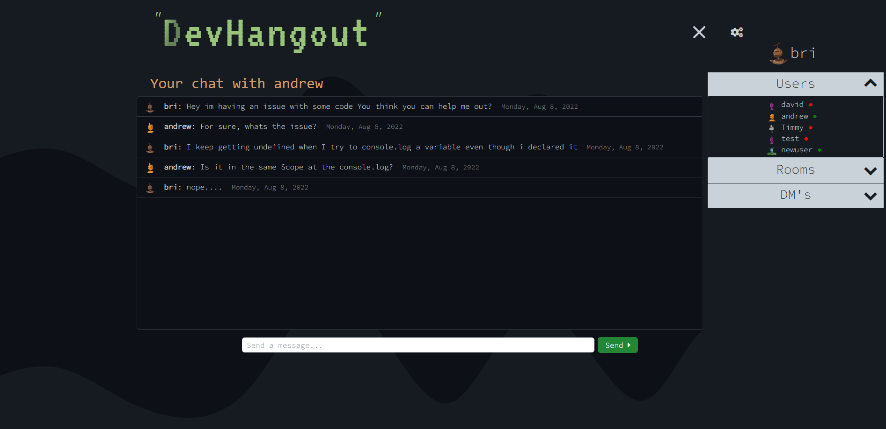

# Developer Hangout

## Description

Developer hangout is an application where developers can communicate and help each other with coding related problems. Its a fullstack app that uses websockets, mysql, express for the back end and handlebars, bootstrap and jquery for the frontend.

## How to use

Visit the deployed app here [https://developer-hangout-657.herokuapp.com/](https://developer-hangout-657.herokuapp.com/)

Register with a username and password. From there you can start chatting. To edit your profile settings and access other rooms click on the hamburger menu located on the top right of the screen.

NOTE: IN order to test the 'live' aspect of this app another user needs to be online with you, OR you can 1: Open a second tab either in the same browser in incognito mode or 2: Open a new tab in a different web browser. Then register a different account and chat with yourself.

## Technologies Used

-Html

-Css

-handleBars

-BootStrap

-JavaScript

-Jquery

-Node.js

-Express

-SocketIO

-Mysql

-Sequelize

